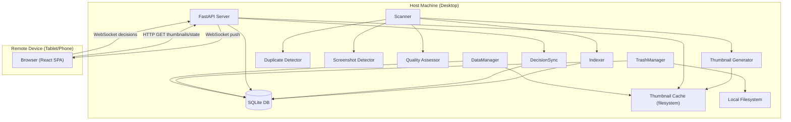
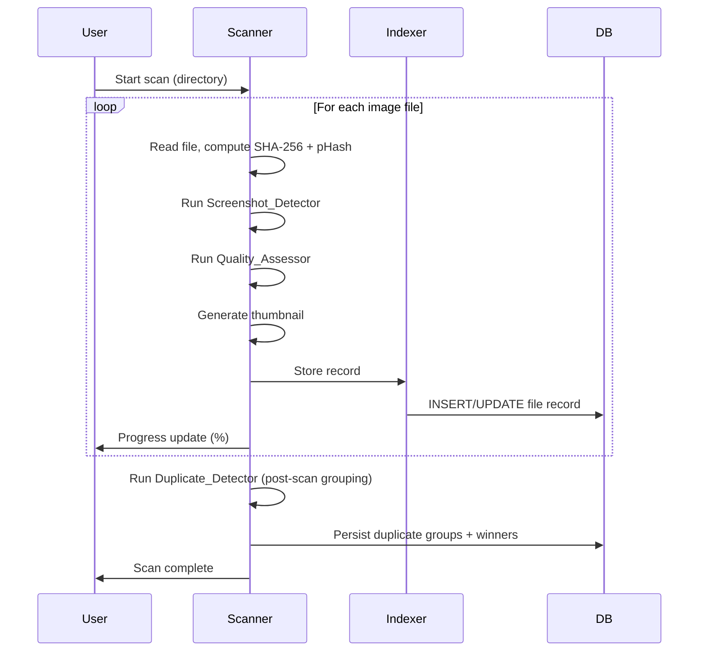

# Design Document

## Overview

Digital Curator MVP is a local-first photo triage application with a two-process architecture: a **Host** (desktop daemon) that performs all heavy computation locally, and a **Remote UI** (browser-based) that runs on a tablet or phone over the local network. The Host exposes a web server; the Remote UI is just a browser pointed at the Host's IP.

The core design principle is **privacy by construction**: original image data never leaves the Host machine. Only stripped thumbnails and JSON decision payloads travel over the local network.

### Technology Choices

| Layer | Technology | Rationale |
|---|---|---|
| Host runtime | Python 3.11+ | Rich imaging ecosystem (Pillow, OpenCV), SQLite stdlib support |
| Web framework | FastAPI + Uvicorn | Async, lightweight, auto-generates OpenAPI docs |
| Database | SQLite (via SQLAlchemy) | Zero-config, file-based, sufficient for local use |
| Image processing | Pillow + OpenCV | Pillow for thumbnails/EXIF strip; OpenCV for Laplacian variance |
| Perceptual hashing | `imagehash` library | Well-tested pHash/dHash implementations |
| Frontend | React + Vite (TypeScript) | Fast HMR, small bundle, runs in any modern browser |
| Real-time sync | WebSocket (FastAPI) | Low-latency decision propagation to Remote UI |
| Trash integration | `send2trash` library | Cross-platform OS Trash support |

---

## Architecture

The system is split into two logical processes that communicate over HTTP and WebSocket on the local network.



### Scan Pipeline (sequential, single Host)



---

## Components and Interfaces

### Scanner

Traverses a directory tree, dispatches each image file to the sub-detectors, and drives the Indexer.

```python
class Scanner:
    def scan(self, directory: Path, progress_callback: Callable[[float], None]) -> ScanResult
```

- Supported extensions: `.jpg`, `.jpeg`, `.png`, `.heic`, `.webp`
- Skips unreadable files, logs error with path, continues
- Reports progress as `files_processed / total_files`

### Indexer

Wraps SQLAlchemy session management. All DB writes go through here.

```python
class Indexer:
    def upsert_file(self, record: FileRecord) -> None
    def upsert_group(self, group: DuplicateGroup) -> None
    def set_decision(self, file_id: int, decision: Decision) -> None
    def set_trashed(self, file_id: int) -> None
    def get_flagged(self, category: Category) -> list[FileRecord]
    def get_group(self, group_id: int) -> DuplicateGroup
```

### DuplicateDetector

Runs after all files are indexed. Groups by SHA-256 first, then clusters by pHash Hamming distance ≤ 10.

```python
class DuplicateDetector:
    def detect(self, records: list[FileRecord]) -> list[DuplicateGroup]
    def _select_winner(self, group: list[FileRecord]) -> FileRecord
```

Winner selection: highest pixel count → tiebreak by highest Laplacian variance.

### ScreenshotDetector

Stateless per-file classifier returning a confidence score 0–3.

```python
class ScreenshotDetector:
    def classify(self, path: Path, metadata: ImageMetadata) -> ScreenshotResult
    # Returns: ScreenshotResult(is_candidate: bool, confidence: int)
```

Criteria (each adds 1 to confidence):
1. No EXIF metadata AND aspect ratio matches known screen ratio (±0.05)
2. Filename contains "screenshot" (case-insensitive)
3. No EXIF capture date

### QualityAssessor

```python
class QualityAssessor:
    def assess(self, path: Path, config: QualityConfig) -> QualityResult
    # Returns: QualityResult(laplacian_variance: float, mean_luminance: float, is_blurry: bool, is_dark: bool)
```

- Laplacian variance computed on grayscale image via OpenCV `cv2.Laplacian`
- Mean luminance computed as mean of L channel in LAB colorspace
- Thresholds are configurable (defaults: blur=100.0, dark=30.0)

### ThumbnailGenerator

```python
class ThumbnailGenerator:
    def generate(self, source: Path, dest: Path) -> bool
    def get_or_create(self, record: FileRecord) -> Optional[Path]
```

- Max dimension 400px (longest side), JPEG output
- Strips all EXIF via Pillow `image.info` clearing before save
- Cache key: `{sha256[:16]}.jpg` stored in `~/.digital-curator/thumbs/`
- Reuses existing thumbnail if file's `last_modified` is unchanged

### DecisionSync

Manages the WebSocket connection pool and broadcasts state changes.

```python
class DecisionSync:
    async def record_decision(self, file_id: int, decision: Decision) -> None
    async def broadcast(self, payload: DecisionPayload) -> None
    async def handle_remote_decision(self, payload: DecisionPayload) -> None
```

- Persists to DB first, then broadcasts to all connected WebSocket clients
- Propagation target: within 5 seconds (typically <100ms on LAN)

### TrashManager

```python
class TrashManager:
    def trash_files(self, file_ids: list[int]) -> TrashResult
    # Returns: TrashResult(trashed: list[int], failed: list[FailedFile])
```

- Uses `send2trash.send2trash()` per file
- On success: calls `Indexer.set_trashed(file_id)`
- On failure: does NOT update DB, returns error info to caller

### DataManager

```python
class DataManager:
    def wipe(self) -> None
```

- Deletes SQLite DB file
- Deletes entire thumbnail cache directory
- Does NOT touch original image files

### FastAPI Routes

| Method | Path | Description |
|---|---|---|
| `POST` | `/scan` | Start a scan on a given directory |
| `GET` | `/scan/progress` | SSE stream of scan progress |
| `GET` | `/triage/{category}` | List flagged files for a category |
| `GET` | `/groups/{group_id}` | Get duplicate group details |
| `GET` | `/thumbs/{file_id}` | Serve thumbnail JPEG |
| `POST` | `/decisions` | Record a Keep/Delete decision |
| `GET` | `/decisions` | Get all current decisions |
| `WS` | `/ws` | WebSocket for real-time decision sync |
| `POST` | `/trash` | Move marked files to Trash |
| `POST` | `/wipe` | Wipe all app data (requires confirmation token) |

---

## Data Models

### SQLite Schema

```sql
CREATE TABLE files (
    id              INTEGER PRIMARY KEY AUTOINCREMENT,
    abs_path        TEXT    NOT NULL UNIQUE,
    file_size       INTEGER NOT NULL,
    last_modified   REAL    NOT NULL,   -- Unix timestamp
    sha256          TEXT    NOT NULL,
    phash           TEXT    NOT NULL,   -- 64-bit hex string
    thumb_path      TEXT,
    thumb_status    TEXT    NOT NULL DEFAULT 'pending',  -- pending|ok|unavailable
    is_screenshot   INTEGER NOT NULL DEFAULT 0,
    screenshot_conf INTEGER NOT NULL DEFAULT 0,
    laplacian_var   REAL,
    mean_luminance  REAL,
    is_blurry       INTEGER NOT NULL DEFAULT 0,
    is_dark         INTEGER NOT NULL DEFAULT 0,
    decision        TEXT    NOT NULL DEFAULT 'undecided', -- undecided|keep|delete
    status          TEXT    NOT NULL DEFAULT 'active'    -- active|trashed
);

CREATE TABLE duplicate_groups (
    id          INTEGER PRIMARY KEY AUTOINCREMENT,
    group_type  TEXT NOT NULL  -- 'exact' | 'near'
);

CREATE TABLE group_members (
    group_id    INTEGER NOT NULL REFERENCES duplicate_groups(id),
    file_id     INTEGER NOT NULL REFERENCES files(id),
    is_winner   INTEGER NOT NULL DEFAULT 0,
    PRIMARY KEY (group_id, file_id)
);
```

### Python Data Classes

```python
@dataclass
class FileRecord:
    id: int | None
    abs_path: Path
    file_size: int
    last_modified: float
    sha256: str
    phash: str
    thumb_path: Path | None
    thumb_status: str          # 'pending' | 'ok' | 'unavailable'
    is_screenshot: bool
    screenshot_conf: int       # 0-3
    laplacian_var: float | None
    mean_luminance: float | None
    is_blurry: bool
    is_dark: bool
    decision: str              # 'undecided' | 'keep' | 'delete'
    status: str                # 'active' | 'trashed'

@dataclass
class DuplicateGroup:
    id: int | None
    group_type: str            # 'exact' | 'near'
    members: list[FileRecord]
    winner_id: int | None

@dataclass
class DecisionPayload:
    file_id: int
    decision: str              # 'keep' | 'delete'
    timestamp: float           # Unix timestamp

@dataclass
class QualityConfig:
    blur_threshold: float = 100.0
    dark_threshold: float = 30.0
```

### JSON Decision Payload (WebSocket / REST)

```json
{
  "file_id": 42,
  "decision": "delete",
  "timestamp": 1718000000.123
}
```

---

## Correctness Properties

*A property is a characteristic or behavior that should hold true across all valid executions of a system — essentially, a formal statement about what the system should do. Properties serve as the bridge between human-readable specifications and machine-verifiable correctness guarantees.*

### Property 1: Scanner discovers all image files

*For any* directory tree containing a known set of image files with supported extensions (JPEG, PNG, HEIC, WEBP), scanning that directory should return a result set that includes every one of those files.

**Validates: Requirements 1.1**

---

### Property 2: Scanner resilience to unreadable files

*For any* directory containing a mix of readable and unreadable image files, the scanner should complete successfully and index all readable files, regardless of how many unreadable files are present.

**Validates: Requirements 1.2**

---

### Property 3: Scan progress is monotonically increasing and bounded

*For any* scan operation, every progress value emitted by the progress callback should be in the range [0.0, 100.0], and the sequence of values should be non-decreasing, ending at 100.0.

**Validates: Requirements 1.3**

---

### Property 4: FileRecord persistence round-trip

*For any* valid `FileRecord` (with all metadata fields populated), writing it to the SQLite database and reading it back should produce a record equivalent to the original, with no field values lost or corrupted.

**Validates: Requirements 1.4, 2.6, 3.5, 4.5, 8.1, 12.1, 12.2, 12.3**

---

### Property 5: Exact duplicate grouping by SHA-256

*For any* collection of file records where some share identical SHA-256 hashes, the `DuplicateDetector` should place all files with the same hash into the same group, and no two files with different hashes should appear in the same exact-duplicate group.

**Validates: Requirements 2.1**

---

### Property 6: Near-duplicate grouping by pHash Hamming distance

*For any* pair of file records whose pHash Hamming distance is ≤ 10, the `DuplicateDetector` should place them in the same `Burst_Group`. For any pair whose distance is > 10, they should not be in the same group.

**Validates: Requirements 2.2**

---

### Property 7: Winner selection correctness

*For any* `Burst_Group`, the designated winner should be the member with the highest pixel count (width × height). If two or more members share the highest pixel count, the winner should be the one among them with the highest Laplacian variance.

**Validates: Requirements 2.4, 2.5**

---

### Property 8: Screenshot detection criteria correctness

*For any* image metadata record, the `ScreenshotDetector` should flag it as a screenshot candidate if and only if at least one of the following holds: (a) it lacks EXIF metadata and its aspect ratio matches a known screen ratio within ±0.05, (b) its filename contains "screenshot" (case-insensitive), or (c) it lacks an EXIF capture date. Furthermore, the confidence score should be monotonically non-decreasing with the number of matching criteria — a file matching N criteria should have a confidence score ≥ a file matching M criteria when N > M.

**Validates: Requirements 3.1, 3.2, 3.3, 3.4**

---

### Property 9: Quality threshold flags

*For any* image, if the computed Laplacian variance is below the configured blur threshold, `is_blurry` should be `True`; otherwise it should be `False`. Similarly, if the computed mean luminance is below the configured dark threshold, `is_dark` should be `True`; otherwise `False`. Both luminance and Laplacian variance values should be non-negative real numbers.

**Validates: Requirements 4.1, 4.2, 4.3, 4.4**

---

### Property 10: Thumbnail dimension constraint

*For any* source image of any dimensions, the generated thumbnail's longest side should be ≤ 400 pixels, and the thumbnail should be a valid JPEG file.

**Validates: Requirements 5.1**

---

### Property 11: Thumbnail EXIF stripping

*For any* source image that contains EXIF metadata (including GPS coordinates or device identifiers), the generated thumbnail should contain no EXIF metadata.

**Validates: Requirements 5.2**

---

### Property 12: Thumbnail generation idempotence

*For any* image file with an unchanged `last_modified` timestamp, calling `get_or_create` twice should return the same thumbnail path, and the thumbnail file's modification time should not change on the second call.

**Validates: Requirements 5.4**

---

### Property 13: Thumbnail failure marks status unavailable

*For any* image file that the `ThumbnailGenerator` cannot process (e.g., corrupt file), the resulting DB record should have `thumb_status = 'unavailable'`, and no partial thumbnail file should remain on disk.

**Validates: Requirements 5.5**

---

### Property 14: Category filter correctness

*For any* category query to the triage API, every file in the response should be flagged for that category, and no file that is not flagged for that category should appear in the response.

**Validates: Requirements 6.2**

---

### Property 15: Group detail includes quality metadata

*For any* duplicate group, the group detail API response should include `width`, `height`, and `laplacian_var` for every member of the group.

**Validates: Requirements 7.3**

---

### Property 16: "Keep Best" assigns correct decisions

*For any* `Burst_Group`, after invoking the "Keep Best" action, the candidate winner's decision should be `'keep'` and every other member's decision should be `'delete'`.

**Validates: Requirements 7.4**

---

### Property 17: Manual winner reassignment

*For any* `Burst_Group` and any member selected as the new winner, after the reassignment, that member's decision should be `'keep'` and all other members' decisions should be `'delete'`.

**Validates: Requirements 7.5**

---

### Property 18: New files default to undecided

*For any* file record inserted by the Indexer, its initial `decision` field should be `'undecided'`.

**Validates: Requirements 8.5**

---

### Property 19: Trash operation correctness and safety

*For any* set of files marked for deletion, after a successful trash operation: (a) each successfully trashed file should no longer exist at its original path, (b) the DB status for each trashed file should be `'trashed'`, and (c) the reported success count should equal the number of files whose DB status was updated. If the trash operation fails for a file, the file should remain at its original path and its DB status should remain unchanged.

**Validates: Requirements 9.1, 9.2, 9.3, 9.4, 9.5**

---

### Property 20: Wipe removes app data but not originals

*For any* wipe operation, after completion: (a) the SQLite database file should not exist, (b) the thumbnail cache directory should be empty or absent, and (c) all original image files that existed before the wipe should still exist at their original paths.

**Validates: Requirements 10.3, 10.4, 10.6**

---

### Property 21: New client receives complete decision state

*For any* set of Keep/Delete decisions recorded before a new Remote UI client connects, the initial state payload delivered to that client should contain all previously recorded decisions.

**Validates: Requirements 11.3**

---

### Property 22: Decision payload serialization round-trip

*For any* valid `DecisionPayload` (with `file_id`, `decision`, and `timestamp`), serializing it to JSON and deserializing it back should produce a payload equivalent to the original, with no field values lost or altered.

**Validates: Requirements 12.4, 12.5, 12.6**

---

## Error Handling

### Scanner errors
- Unreadable files: log `WARNING` with absolute path, skip file, continue scan. Never abort the scan.
- Unsupported extension: silently skip (not an error).
- Directory permission denied: log `ERROR`, skip subtree, continue.

### Indexer / DB errors
- Write failure: log `ERROR` with record details, surface error to caller. Do not silently swallow.
- Schema migration: use Alembic for versioned migrations; fail fast on version mismatch.

### ThumbnailGenerator errors
- Corrupt or undecodable image: log `WARNING`, set `thumb_status = 'unavailable'` in DB, do not leave partial files.
- Disk full: log `ERROR`, propagate exception to Scanner, halt thumbnail generation.

### TrashManager errors
- `send2trash` raises exception: log `ERROR` with file path, do NOT update DB status, include file in `failed` list of `TrashResult`.
- Partial failure (some files trashed, some not): report both counts to user; DB reflects only successfully trashed files.

### DecisionSync / WebSocket errors
- Client disconnects mid-broadcast: remove from connection pool, log `DEBUG`. No retry needed (client will re-sync on reconnect via full state load).
- Malformed JSON payload from Remote UI: log `WARNING`, send error frame back to client, ignore payload.

### DataManager / Wipe errors
- DB file already absent: treat as success (idempotent).
- Thumbnail directory already absent: treat as success (idempotent).
- Partial wipe failure: log `ERROR`, report to user which step failed. Do not attempt to roll back completed steps.

### HTTP API errors
- All 4xx/5xx responses return a JSON body: `{"error": "<message>", "detail": "<optional detail>"}`
- 404 for unknown `file_id` or `group_id`
- 409 for conflicting decisions (e.g., marking a trashed file)
- 500 for unexpected internal errors with a sanitized message

---

## Testing Strategy

### Dual Testing Approach

Both unit tests and property-based tests are required. They are complementary:
- **Unit tests** verify specific examples, integration points, and error conditions.
- **Property tests** verify universal correctness across randomly generated inputs.

### Property-Based Testing

**Library**: [`hypothesis`](https://hypothesis.readthedocs.io/) (Python)

Each correctness property from the Correctness Properties section above must be implemented as a single Hypothesis property test. Tests must be tagged with a comment referencing the design property.

Tag format: `# Feature: digital-curator-mvp, Property {N}: {property_text}`

Minimum 100 iterations per property test (Hypothesis default is 100; do not reduce this).

Example:

```python
from hypothesis import given, settings
import hypothesis.strategies as st

# Feature: digital-curator-mvp, Property 4: FileRecord persistence round-trip
@given(st.builds(FileRecord, ...))
@settings(max_examples=100)
def test_file_record_round_trip(record: FileRecord):
    indexer.upsert_file(record)
    retrieved = indexer.get_file(record.abs_path)
    assert retrieved == record
```

### Unit Tests

Unit tests should cover:
- Specific examples for each component (one happy-path test per public method)
- Error injection: unreadable files, corrupt images, `send2trash` failures, DB write failures
- Edge cases: empty directory scan, single-file group, all files in one group, zero-byte image
- API integration: each FastAPI route returns correct status codes and response shapes
- WebSocket: client connects, receives initial state, receives broadcast on decision change

### Test Structure

```
tests/
  unit/
    test_scanner.py
    test_duplicate_detector.py
    test_screenshot_detector.py
    test_quality_assessor.py
    test_thumbnail_generator.py
    test_decision_sync.py
    test_trash_manager.py
    test_data_manager.py
    test_api.py
  property/
    test_prop_scanner.py          # Properties 1, 2, 3
    test_prop_persistence.py      # Properties 4, 18
    test_prop_duplicates.py       # Properties 5, 6, 7
    test_prop_screenshot.py       # Property 8
    test_prop_quality.py          # Property 9
    test_prop_thumbnails.py       # Properties 10, 11, 12, 13
    test_prop_triage.py           # Properties 14, 15, 16, 17
    test_prop_trash.py            # Property 19
    test_prop_wipe.py             # Property 20
    test_prop_sync.py             # Properties 21, 22
```

### Coverage Target

- Core business logic (Scanner, DuplicateDetector, ScreenshotDetector, QualityAssessor, ThumbnailGenerator, TrashManager, DataManager): ≥ 90% line coverage
- API routes: ≥ 80% line coverage
- Frontend: component-level tests with React Testing Library for triage UI interactions
